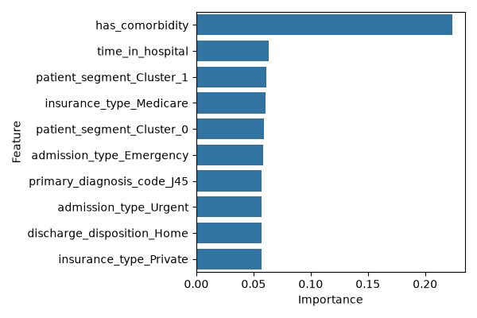

# HealthGuard AI

HealthGuard AI is a healthcare machine learning project focused on predicting 30-day hospital readmission risk from patient clinical data. It combines exploratory data analysis, feature engineering, clustering, recursive feature selection, supervised learning, and a Streamlit dashboard to produce interpretable risk estimates and model insights.

## What This Project Does

HealthGuard AI takes patient clinical inputs, preprocesses them, groups similar patients with K-Means, reduces noise with Recursive Feature Elimination, and compares Logistic Regression and XGBoost outputs to estimate readmission risk.

The project is organized around two notebooks for analysis and training, a reusable ML pipeline in `src/`, and a Streamlit app for live prediction and explanation.

## Resume Summary

· Developed and evaluated a multi-stage machine learning pipeline for 30-day hospital readmission prediction using K-Means clustering, Recursive Feature Elimination, Logistic Regression, and XGBoost.

· Performed exploratory data analysis, data cleaning, feature engineering, and preprocessing on clinical patient records to improve model readiness and interpretability.

· Built a reusable training and prediction workflow for model benchmarking, feature-importance analysis, and patient risk scoring across healthcare datasets.

## Core Features

· Clinical dataset exploration and visualization with pandas, NumPy, matplotlib, and seaborn.

· Feature selection and model comparison across interpretable and non-linear algorithms.

· Risk scoring workflow for healthcare readmission prediction.

· Notebook-based analysis and evaluation for reproducible experimentation.

· Streamlit live predictor for entering patient data and generating a risk estimate.

· Patient personas from K-Means clustering to show the type of patient pattern being evaluated.

· Logistic Regression and XGBoost driver tables to explain why the model produced a given score.

· Dataset preview inside the app so the data and outputs are visible in one place.

## What The App Shows

The Streamlit app includes three main views:

· Overview: project summary, dataset size, overall readmission rate, and selected feature count.

· Live Predictor: a patient input form, risk tier, ensemble score, logistic score, XGBoost score, patient segment, and top drivers.

· Dataset: a preview of the clinical dataset and the patient persona definitions used by the pipeline.

## Repository Structure

- `app.py` - Streamlit entrypoint for the interactive demo
- `notebooks/` - EDA and model training notebooks
- `src/` - Data processing, model pipeline, and prediction logic
- `data/` - Readmission dataset used for analysis and training
- `tests/` - Basic pipeline checks
- `requirements.txt` - Python dependencies
- `test_xgb_importances.png` - Screenshot reference of the Streamlit output

## How To Run

```bash
pip install -r requirements.txt
streamlit run app.py
```

If you are on Windows, you can also use the batch file:

```bash
start_app.bat
```

If you want to work with the notebooks instead of the app:

```bash
jupyter notebook
```

Recommended order:

1. Open `notebooks/01_exploratory_data_analysis.ipynb` for data exploration.
2. Open `notebooks/02_model_training_and_eval.ipynb` for pipeline training and evaluation.
3. Run `streamlit run app.py` to launch the interactive demo.

## Main Components

- `notebooks/01_exploratory_data_analysis.ipynb` for data exploration and visualization
- `notebooks/02_model_training_and_eval.ipynb` for pipeline training and evaluation
- `src/model.py` for the 4-stage ML pipeline
- `src/data_processing.py` for preprocessing and target preparation
- `src/predict.py` for preset patient profiles and prediction helpers
- `app.py` for the Streamlit dashboard

## Output Reference

The screenshots below show the Streamlit output after running a sample patient through the predictor.



The app output is shown across five views:

1. Live Predictor input form with patient fields and defaults.
2. Prediction result summary with risk tier and ensemble score.
3. Logistic Regression driver table showing the most important explainable features.
4. XGBoost driver table showing the top non-linear feature importances.
5. Overview and dataset views showing the project summary, dataset size, and patient persona definitions.

These screenshots illustrate the full user flow from entering patient data to reviewing the model explanation and dataset context.

## Validation Status

The following checks were performed while updating this project:

· `app.py` syntax and notebook-linked runtime flow are clean.

· The Streamlit app launches successfully with `streamlit run app.py`.

· The app renders the overview, live predictor, and dataset views without a `NameError`.

· The screenshot reference currently present in the repository is `test_xgb_importances.png`.

Known limitation:

· The five screenshots shown in chat are not saved as files in the repository yet, so they cannot be embedded as separate image links until they are added to the workspace.

## Notes

The project is now centered on the notebook workflow, Python ML pipeline, and the Streamlit demo rather than the older Node-based stack.
